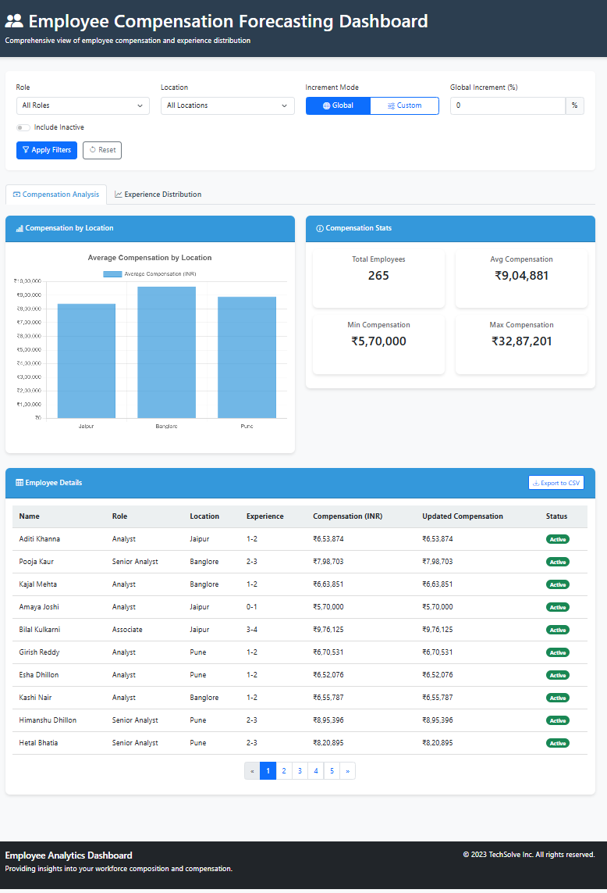
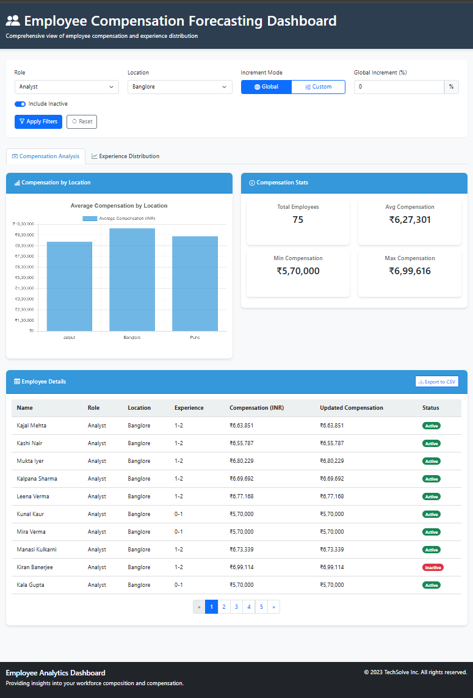
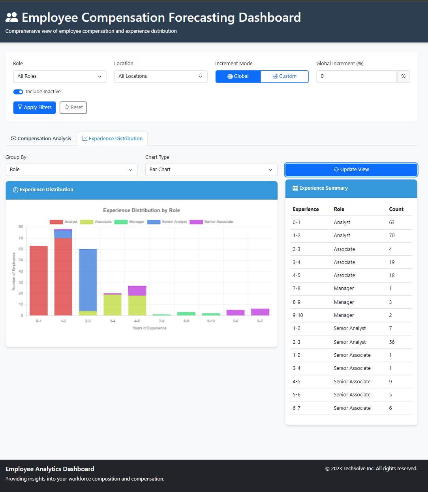

```markdown
# Employee Compensation Dashboard



A web application for analyzing employee compensation data with simulation capabilities.

## Table of Contents
- [Technologies Used](#technologies-used)
- [Setup Instructions](#setup-instructions)
- [User Stories](#user-stories)
- [Screenshots](#screenshots)

## Technologies Used

### Backend
- **Framework**: ASP.NET Core Web API
- **Database**: MySQL
- **ORM**: Dapper
- **Hosting**: Self-hosted/Kestrel

### Frontend
- **UI Framework**: Bootstrap 5
- **Charts**: Chart.js
- **Data Handling**: JavaScript (ES6+)
- **CSV Export**: PapaParse

### Development Tools
- **IDE**: Visual Studio 2022
- **Database Client**: MySQL Workbench
- **API Testing**: Postman

## Setup Instructions

### Database Setup
1. Create a new MySQL database:
   ```sql
   CREATE DATABASE EmployeeCompensationdb;
   USE EmployeeCompensationdb;
   ```

2. Import the provided SQL file:
   ```folder
   (./MySQL/)
   ```
3. Import the provided SQL file:
   ```folder
   (./MySQL/Stored Procedure)
   ```
4. Configure connection string in `appsettings.json`:
   ```json
   {
     "ConnectionStrings": {
       "DefaultConnection": "Server=localhost;Database=EmployeeCompensationdb;Uid=root;Pwd=NT@wfeeqA07;"
     }
   }
   ```

### Running the Application
1. Start the backend API:
   ```bash
   cd EmployeeCompensationAPI
   dotnet run
   ```

2. Access the frontend:
   ```
   https://localhost:5001/index.html
   ```

3. Default credentials (if applicable):
   - Username: admin
   - Password: admin123

## User Stories

### 1. Filter and Display Employees
**Implementation**:
- Role, location, and status filters at the top
- Interactive compensation chart
- Export to CSV functionality
- Paginated employee table

**Technical Details**:
- Optimized SQL queries
- Client-side filtering
- Responsive data table

### 2. Experience Distribution
**Implementation**:
- Group employees by experience ranges
- Visualize with interactive charts
- Breakdown by location/role
- Summary statistics

**Technical Details**:
- Dynamic Chart.js rendering
- Server-side aggregation
- Mobile-responsive design

### 3. Compensation Simulation
**Implementation**:
- Global percentage increment control
- Location-specific overrides
- Visual comparison of current vs new compensation
- Reset simulation option

**Technical Details**:
- Non-destructive calculation
- Real-time updates
- Color-coded changes

## Screenshots

### Dashboard View


### Compensation Analysis


### Experience Distribution


```
